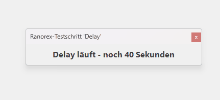
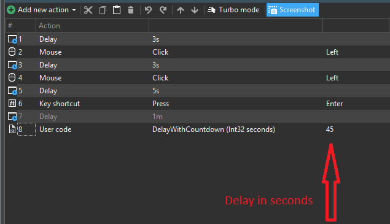

# DelayWithCountdown

Ranorex helper displaying a floating countdown window during delay steps.

## Usage

```csharp
DelayWithCountdown(30);
```

## Notes

- Uses WinForms
- Intended for Ranorex UserCode
- Keeps the countdown window always on top

## Demo



## Screenshot

