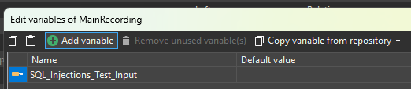
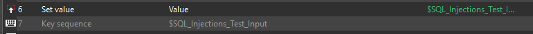
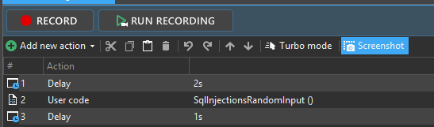

## Notes

- Tests Free Text Search fields and other text input controls for potential SQL Injection / Search Query Injection vulnerabilities
- Intended for Ranorex UserCode
- Randomly selects a payload from a configurable CSV file
- Stores the selected payload in the Ranorex variable `SQL_Injections_Test_Input`
- Supports easy extension of the payload library without modifying the UserCode
- Use **Set Value** instead of **Key Sequence** when entering payloads containing special characters such as `{}`

## Demo

The `SqlInjectionsRandomInput` method randomly selects a payload from the configured CSV file and stores it in the Ranorex variable `SQL_Injections_Test_Input`.

Before the payload can be used in a recording, the UserCode method must be executed.

The selected payload can then be inserted into the target field using **Set Value**.

The payload list is loaded from:

```csharp
string filePath = @"<insert path to payload file here>\SQL_Search_Test_Payloads_Runtime.csv";
```

Each test execution uses a single randomly selected payload from the CSV file.

After the search is triggered (e.g. Search button and/or Enter key), the application should preserve the entered payload exactly as entered.

Unexpected modifications, additional characters, error messages, exposed data, or abnormal application behaviour may indicate a potential security issue.

## Screenshot

### Variable Configuration



### Using Set Value



### Executing the UserCode

