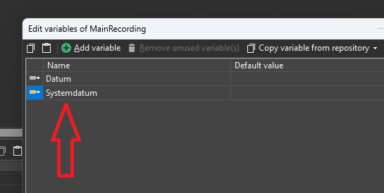
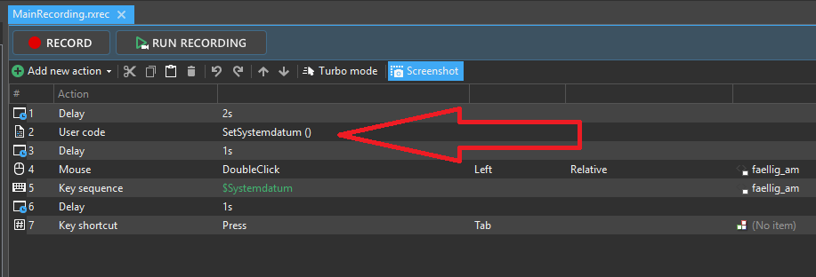
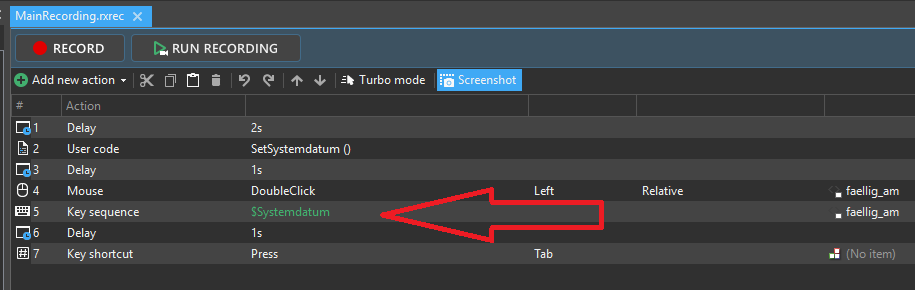
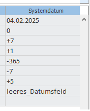

# SetSystemdatum

Ranorex UserCode helper for reliable system date handling in test automation projects.

This utility avoids Excel-based Ranorex variable table date caching issues, where the first test execution of the day may incorrectly use the previous execution date instead of the current system date.

## Features

- Uses the current Windows system date
- Supports current, future, and past date calculation
- Supports fixed dates from the variable table
- Supports empty date field handling
- Can be used for key sequence input and validation

## Supported Variable Values

| Variable Value | Meaning |
|---|---|
| `0` | Current date |
| `+7` | Current date + 7 days |
| `-365` | Current date - 365 days |
| `01.01.2025` | Fixed explicit date |
| `leeres_Datumsfeld` | Empty date field handling |

## Usage

### 1. Create a Ranorex variable named `Systemdatum`



### 2. Execute the UserCode method `SetSystemdatum()`



### 3. Use the variable `Systemdatum`

The variable can now be used as key sequence input or for validation.



## Important Difference Between Input and Validation Test Steps

### Input test steps

For key sequence input, `leeres_Datumsfeld` should result in:

```text
TT.MM.JJJJ
```

### Validation test steps

For validation, `leeres_Datumsfeld` should result in an empty value:

```text

```

Additionally, validation uses a different adapter:

```xpath
.//label[@innertext='fällig am']/..//div[@class~'textfield']/.//input[@tagvalue=$Systemdatum]
```

Suggested validation test step name:

```text
Systemdatum_faellig_am_validierung_TagValue_Equal
```

## Additional Notes

In diesem Testschritt zur Validierung des Datums wird Ranorex User Code verwendet, der den aktuellen Systemwert des Datums ermittelt.

```text
Methode: UserCodeMethod > SetSystemdatum()
```

Zur Nutzung dieser Methode müssen Variablen aus der Spalte „Systemdatum“ in der Datei/Tabelle „Datum“ verwendet werden.

Die Datumswerte werden wie folgt definiert:

- `0` für „aktuelles Datum“
- positive Ganzzahlen für zukünftige Daten, z. B. `+7` = aktuelles Datum + 1 Woche
- negative Ganzzahlen für vergangene Daten, z. B. `-365` = aktuelles Datum - 1 Jahr
- `leeres_Datumsfeld` = leeres Datumsfeld (`TT.MM.JJJJ`)
- Testschritte, die die Variable `Systemdatum` verwenden, übergeben nach Auswahl in der Variablentabelle im klassischen Format, z. B. `01.01.2020`, dieses Datum unverändert an Ranorex.

Während der Arbeit in Ranorex ist ebenfalls die Variable `Systemdatum` zu erstellen bzw. zu verwenden.

